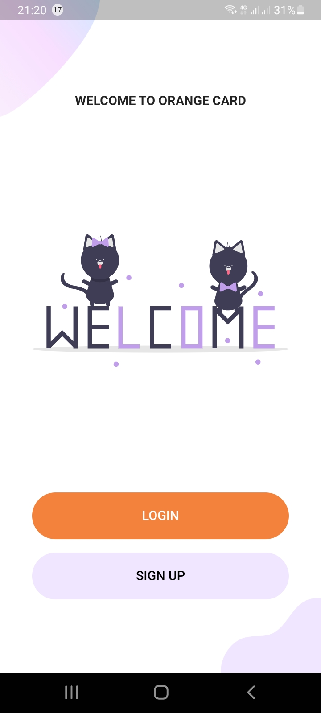
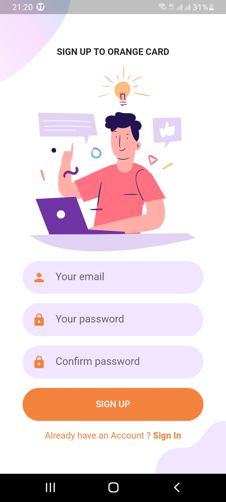
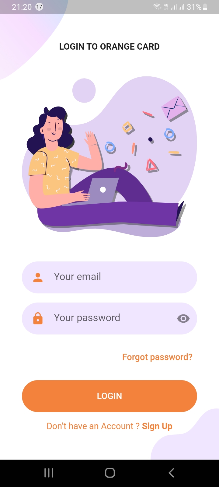
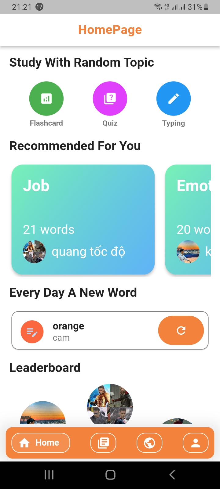
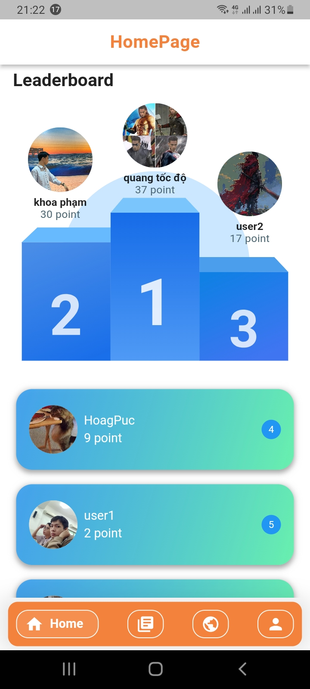
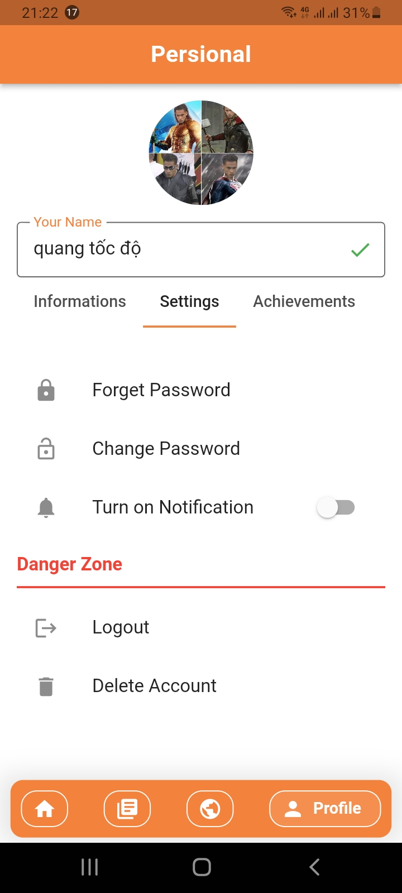
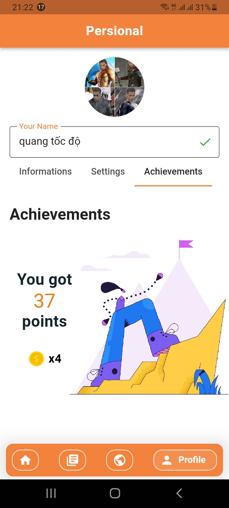
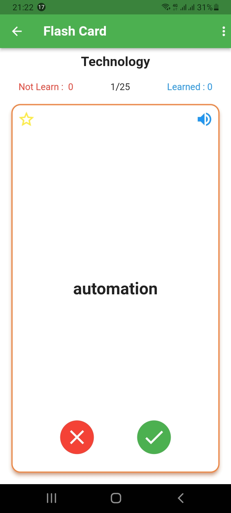
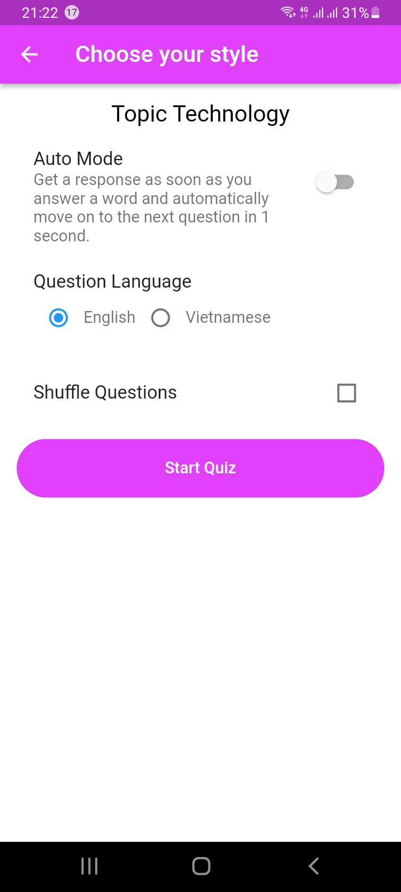

# 🍊 orange_card: Học tiếng Anh hiệu quả với Flashcard

## Màn hình giao diện

### Authentication

  
  
  

### Home

  
  
  
    
    

### Profile

  
  
  

### Leaning

  
  
  
    
      

